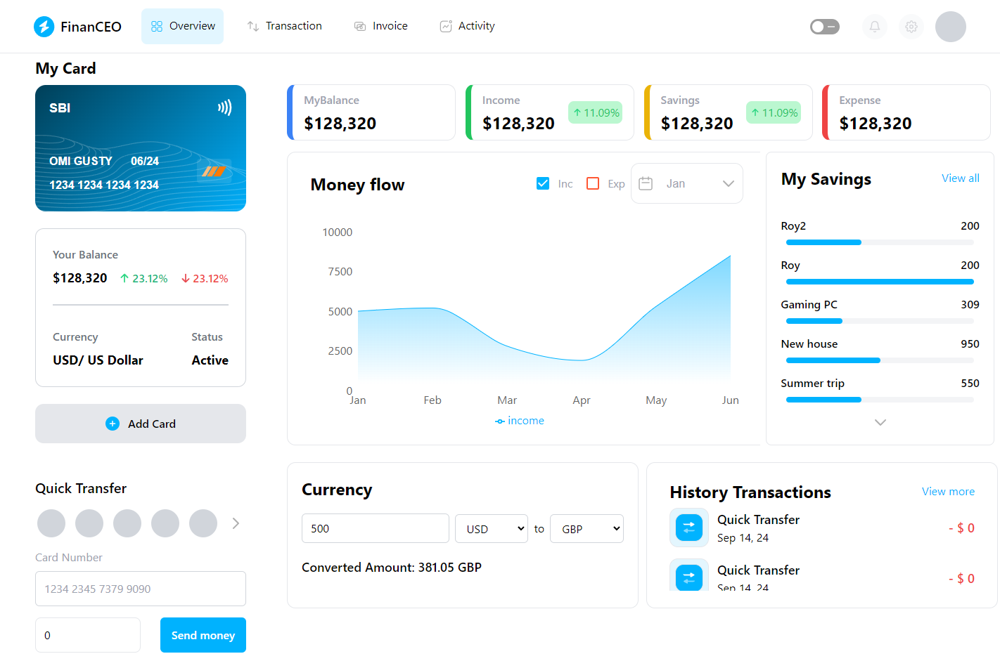
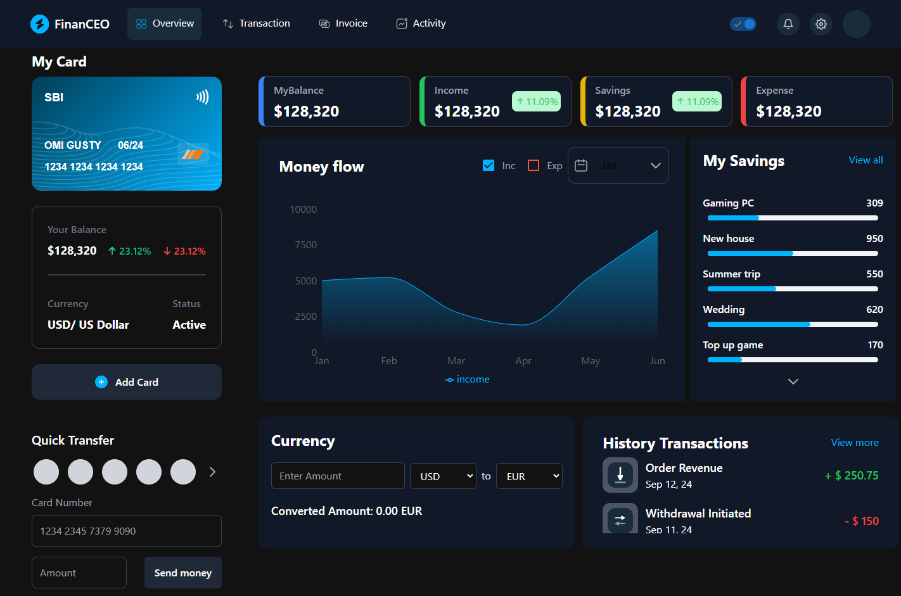
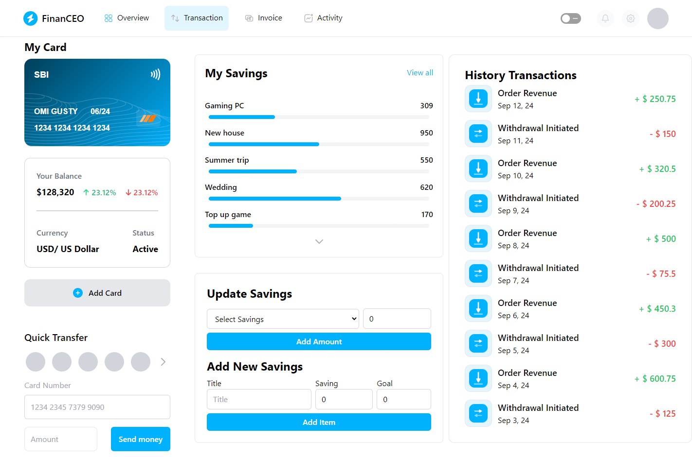

<h1 align='center'>
FinanCEO
</h1>
<p align='center' style="font-size:1.5em; font-weight:bold;">
"A Financial Dashboard Application for all your needs."💸
</p>

Transform the way you manage your finances with [App Name], the ultimate financial dashboard app. Seamlessly track your income, expenses, and investments in one intuitive platform. Gain real-time insights, set personalized goals, and make informed decisions with our powerful analytics.
##### View Deployment: https://financeo.vercel.app/


## Built With
<p align='center'> 


</p>

## Home Page ScreenShot
<p align='center'>



</p>

## For using on local machine

#### Clone the Repository
```bash
git clone https://github.com/R0Y15/FinanCEO.git
```

#### Install the Project Using
```bash
npm install
# or
yarn install
```

#### Create a .env file in the root directory and add the following
```bash
NEXT_PUBLIC_FIREBASE_API_KEY= [your firebase api key]
NEXT_PUBLIC_FIREBASE_AUTH_DOMAIN= [your firebase auth domain]
NEXT_PUBLIC_FIREBASE_PROJECT_ID= [your firebase project id]
NEXT_PUBLIC_FIREBASE_STORAGE_BUCKET= [your firebase storage bucket]
NEXT_PUBLIC_FIREBASE_MESSAGING_SENDER_ID= [your firebase messaging sender id]
NEXT_PUBLIC_FIREBASE_APP_ID= [your firebase app id]

NEXT_PUBLIC_EXCHANGERATE_API_KEY= [your exchangerate api key]
```

#### Run the Project Using
```bash
npm run dev
#or
yarn dev
```

#### View the local deployment at
```bash
http://localhost:3000
```

## Contributing

Please feel free to contribute to this repository. Contributions are always welcomed. 
Create a pull request incase you feel some more better changes could be made to the site and we will review your changes.
